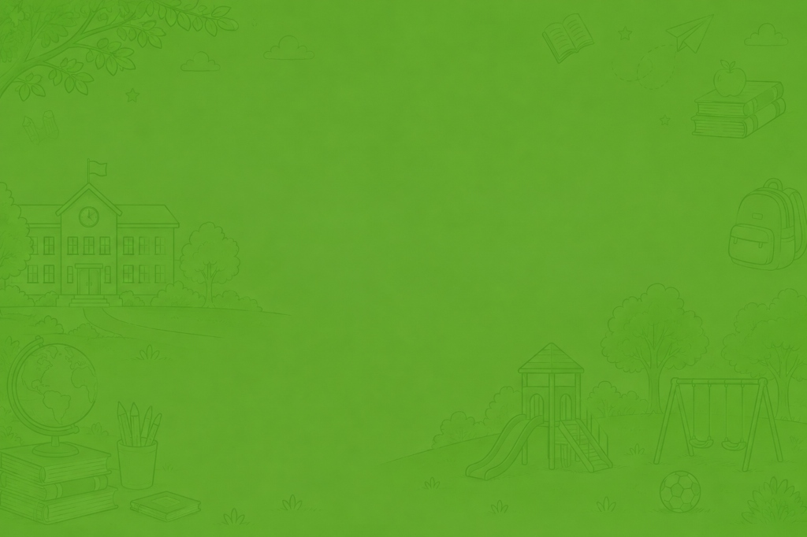

# 🎓 ST. VENUS HIGH SCHOOL - Student & Fee Management System

A comprehensive, responsive, and feature-rich Web-Based School & Student Management System built for modern educational administration.



---

## 🌟 Key Features

- 📋 **Master Student Database**: Complete admission records, student profile details, parent information, and contact management.
- 💳 **Fee Payment Tracker**: Track installment payments, fee balances, fee receipts, payment modes, and generate detailed fee registers.
- 📊 **Academic Progress Cards**: Report cards generation, subject-wise scoring, grading system, class performance analytics, and term reports.
- 🖨️ **Document & Certificate Generation**: Instant printable certificates (Bonafide, Transfer Certificate (TC), Study & Conduct Certificates, etc.).
- 📁 **Tabbed Modern UI**: Sleek folder-style trapezoid navigation tabs with responsive layouts and smooth micro-interactions.
- 📥 **Excel / CSV Import & Export**: Fast client-side spreadsheet data import and export capabilities powered by SheetJS.
- ⚡ **Local / Offline Server Support**: Includes lightweight PowerShell web server scripts for instant zero-dependency local hosting.

---

## 🚀 Live Demo & Deployment

- 🌐 **Live Vercel Application**: [https://temporary-zippy-opal-c7bxsio.vercel.app](https://temporary-zippy-opal-c7bxsio.vercel.app)
- 📌 **Claim / Add to Vercel Account**: [Claim Deployment](https://vercel.com/claim-deployment?code=c6f88399-e6f4-4093-80a7-404f650ca126)
- 🚀 **1-Click GitHub Deploy**: [](https://vercel.com/new/clone?repository-url=https%3A%2F%2Fgithub.com%2Fmanzoorsks-source%2Fstudent-management)

---

## 🚀 Getting Started

### 1. Direct Browser Access
Simply double-click [`index.html`](index.html) to open the application directly in any modern web browser (Google Chrome, Microsoft Edge, Mozilla Firefox, Safari).

### 2. Running with Local PowerShell Server
You can also run the bundled lightweight server:
```powershell
.\start_server.ps1
```
Open your browser and navigate to `http://localhost:8080` (or the port specified in console).

---

## 📁 Repository Structure

```
├── index.html                     # Core Single Page Web Application
├── school_bg.jpg                  # Background branding & theme imagery
├── Students_Master_Data.csv       # Student roster template & sample dataset
├── Academic_Progress_Cards.csv    # Academic scoring template dataset
├── Fee_Payment_Tracker.csv        # Fee ledger & payment template dataset
├── create_excel_template.ps1      # Utility script for generating Excel templates
├── start_server.ps1               # Lightweight local HTTP server launcher
├── .gitignore                     # Git ignore rules
└── README.md                      # Documentation
```

---

## 🛠️ Built With

- **HTML5 & CSS3** - Custom styling, glassmorphism UI, and folder-tab layouts
- **TailwindCSS** - Responsive modern styling
- **JavaScript (ES6+)** - Client-side state management, filtering, and printing
- **SheetJS (xlsx.full.min.js)** - Client-side spreadsheet parsing & generation
- **Google Fonts** - *Inter* & *Outfit* typography

---

## 📜 License
Private & Proprietary - ST. VENUS HIGH SCHOOL
